# 👻 chbaye7 — Ghost Ride

[](https://www.typescriptlang.org/)
[](https://pnpm.io/workspaces)
[](https://expo.dev/)
[](https://expressjs.com/)
[](https://socket.io/)

**chbaye7** (pronounced *"Sh-ba-yeh"*, Tunisian Arabic for *"Ghosts"* or *"Phantoms"*) is a premium, highly responsive ghost-themed mobile ride-hailing MVP. 

In this hauntingly unique platform, riders summon phantom drivers from the netherworld, while online drivers accept and reject dispatched ride requests in real-time. The application features a stunning, neon-glowing, dark-only user interface designed to feel atmospheric and immersive.

---

## 🔮 System Architecture & Real-Time Flow

The real-time lifecycle of a ghost ride is orchestrated via Socket.io with strong race-condition safety guarantees. Here is how riders and drivers interact through the backend:

```mermaid
sequenceDiagram
    autonumber
    actor Rider as 👩‍ Rider (Client)
    participant Server as 🧠 Express + Socket.io Server
    actor Driver as 👻 Driver (Client)

    %% Authentication & Connection
    Note over Rider, Driver: All connections authenticated via JWT in headers/handshake
    Driver->>Server: Connect & join "drivers" room (online toggle)
    
    %% Ride Request Flow
    Rider->>Server: HTTP POST /api/rides (Create Ride)
    Server-->>Server: Write ride to MongoDB (status: 'searching')
    Server->>Driver: Socket Emit `ride:new` (Broadcast to all online drivers)
    
    %% Dispatch & Race Condition Window
    Note over Driver: Ride card pops up with glowing progress ring
    Driver->>Server: Socket Emit `ride:accept`
    
    rect rgb(30, 10, 50)
        Note over Server: Atomic Update Check<br/>findOneAndUpdate({ status: 'searching', driverId: null })
        alt Driver is first to accept
            Server-->>Server: Commit driverId & update status to 'accepted'
            Server->>Rider: Socket Emit `ride:updated` (Status: accepted)
            Server->>Driver: Socket Emit `ride:accepted:success`
        else Another driver accepted first
            Server->>Driver: Socket Emit `ride:accepted:fail` (Error: Already accepted)
        end
    end

    %% Ride Execution
    Driver->>Server: HTTP PATCH /api/rides/:id (status: 'arrived')
    Server->>Rider: Socket Emit `ride:updated` (Status: arrived)
    
    Driver->>Server: HTTP PATCH /api/rides/:id (status: 'started')
    Server->>Rider: Socket Emit `ride:updated` (Status: started)
    
    Driver->>Server: HTTP PATCH /api/rides/:id (status: 'completed')
    Server->>Rider: Socket Emit `ride:updated` (Status: completed)
    Rider-->>Rider: Show ride receipt & wrap up!
```



---

## 🛠️ The Tech Stack

The workspace utilizes a modern monorepo setup powered by **PNPM Workspaces** to share configuration, API contracts, and types seamlessly:

- **Monorepo Management:** [PNPM Workspaces](https://pnpm.io/workspaces) + TypeScript 5.9
- **Backend API:** Express 5 (routing/controllers) + Socket.io 4 (real-time events) + Mongoose 8 / MongoDB (data storage)
- **Mobile Client:** [Expo](https://expo.dev/) (React Native) + `expo-router` (file-based navigation) + React Query (server state synchronization)
- **Real-Time Client:** Socket.io-client (integrated into custom context React hooks)
- **Authentication:** Stateless JSON Web Tokens (JWT) stored securely via `AsyncStorage` on mobile
- **UI & Aesthetics:** Dark-only ghost theme using custom linear gradients (`expo-linear-gradient`), micro-animations (`react-native-reanimated`), and premium icons (`@expo/vector-icons`)
- **API Spec & Codegen:** OpenAPI v3 specifications + [Orval](https://orval.dev/) for generating fully-typed React Query hooks and Zod validation schemas

---

## 📂 Project Structure

```bash
chbaye7/
├── backend/                  # Node.js + Express API server
│   ├── src/
│   │   ├── controllers/      # Route controllers (auth, rides)
│   │   ├── middlewares/      # Request verification (e.g., JWT Auth)
│   │   ├── models/           # Mongoose schemas (User, Ride)
│   │   ├── routes/           # REST endpoints
│   │   └── sockets/          # Socket.io dispatch handlers
│   └── tsconfig.json
├── frontend/                 # Expo Mobile Application
│   ├── app/
│   │   ├── (auth)/           # Authentication screens (Login, Register)
│   │   ├── (rider)/          # Rider flows (Summon, Ride Tracking)
│   │   ├── (driver)/         # Driver dashboard (Online Toggle, Accept/Reject, Controls)
│   │   └── _layout.tsx       # Root entrypoint & Router config
│   ├── components/           # Custom reusable widgets (GhostButton, GlowCard, etc.)
│   ├── context/              # Global React contexts (AuthContext, SocketContext)
│   ├── hooks/                # Color palettes, custom utilities
│   └── package.json
├── lib/                      # Core Shared Workspace Packages
│   ├── api-spec/             # OpenAPI v3 spec yaml (source of truth)
│   ├── api-client-react/     # Generated React Query API client hooks (via Orval)
│   └── api-zod/              # Generated Zod validation schemas (via Orval)
├── package.json              # Monorepo root configuration
├── pnpm-workspace.yaml       # PNPM Workspace packages registry
└── tsconfig.base.json        # Base TypeScript rules shared by apps/libs
```

---

## ⚡ Setup & Development

### 1. Prerequisites
Make sure you have the following installed:
* [Node.js](https://nodejs.org/) (v24+ recommended)
* [PNPM](https://pnpm.io/installation) (v9+ recommended)
* A running [MongoDB](https://www.mongodb.com/) instance (local or Atlas cluster)

### 2. Environment Configuration
Create a `.env` file in the `backend/` directory with the following variables:

```env
MONGODB_URI=mongodb+srv://<username>:<password>@cluster.mongodb.net/chbaye7?retryWrites=true&w=majority
JWT_SECRET=your_jwt_haunting_secret_key
SESSION_SECRET=your_session_haunting_secret_key
PORT=8080
```

### 3. Install Dependencies
Run the installation command from the root directory:
```bash
pnpm install
```

### 4. Running the Development Servers

Use workspace filter flags to fire up backend, frontend, or both simultaneously:

* **Start the Backend API Server:**
  ```bash
  pnpm --filter @workspace/backend run dev
  ```
  *The server starts on port `8080`. API endpoints are accessible at `/api`.*

* **Start the Expo Mobile Client:**
  ```bash
  pnpm --filter @workspace/frontend run dev
  ```
  *Launches the Expo CLI. Press `w` to open in your web browser, or scan the QR code using the Expo Go mobile app (iOS/Android).*

* **Typecheck entire monorepo:**
  ```bash
  pnpm run typecheck
  ```

---

## 🧠 Key Architectural Decisions

### 🎃 Broadcast Dispatch Pattern
To simulate the rapid, chaotic arrival of phantoms, rides are broadcasted to *all* online drivers currently in the `"drivers"` socket room using the `ride:new` event. 

To eliminate double-acceptance:
1. When a driver clicks "Accept", the backend executes an atomic Mongoose update:
   ```typescript
   const updatedRide = await Ride.findOneAndUpdate(
     { _id: rideId, status: 'searching', driverId: null },
     { status: 'accepted', driverId: driverId },
     { new: true }
   );
   ```
2. If `updatedRide` is returned, that driver successfully claimed the ride, and other drivers are immediately notified of the claim. If it returns null, another phantom driver claimed it first.

### 🌌 Dark-Only Aesthetic Tokens
To match the paranormal visual vibe, the application strictly uses a preset dark palette across all components. Avoid standard bright colors:
- **Abyss (Background):** `#0A0A0A`
- **Ectoplasm (Primary Neon):** `#00D4FF` (Glowing Cyan)
- **Spectral Blue (Accent):** `#0050FF`
- **Phantom White (Text):** `#F3F4F6`

### 🔄 API Spec-Driven Codegen
All network communications are strongly typed. The OpenAPI spec in `lib/api-spec/openapi.yaml` represents the single source of truth. If any route endpoint or data structure changes:
1. Modify `lib/api-spec/openapi.yaml`.
2. Regenerate TypeScript interfaces, React Query hooks, and Zod schemas with:
   ```bash
   pnpm --filter @workspace/api-spec run codegen
   ```
3. Type-safety errors will immediately flag out in your IDE or during `pnpm run typecheck`.

---

## 👻 Gotchas & Troubleshooting

* **Socket.io Custom Path:** Ensure all environments set the Socket.io path to `/api/socket.io`. The client and backend are pre-configured this way to allow proxy routing through Replit gateways.
* **Database Access:** Check that the MongoDB Atlas user has standard `readWrite` permissions on the database defined in your `MONGODB_URI` connection string.
* **Offline Expo Testing:** If running on a physical mobile device with Expo Go, ensure your phone and computer are connected to the exact same Wi-Fi network, and use the `pnpm --filter @workspace/frontend start --tunnel` command if network isolation issues prevent connections.

Enjoy the ride with **chbaye7**! 💀🚕
# chbaye7

