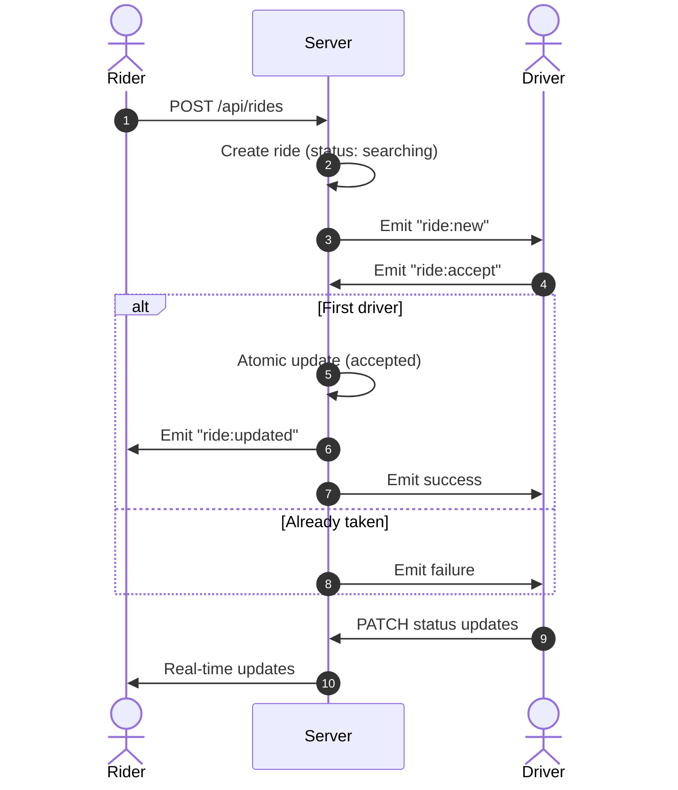

# 👻 chbaye7 — Ghost Ride


**chbaye7** (pronounced *Sh-ba-yeh*, Tunisian Arabic for *“Ghosts”*) is a real-time, ghost-themed ride-hailing MVP built for performance, responsiveness, and immersive UX.

The platform connects riders and drivers through a live dispatch system powered by WebSockets, wrapped in a dark, neon-glowing UI designed to feel atmospheric and cinematic.

---

## 🔮 Overview

- 🚕 Riders can request rides instantly  
- 👻 Drivers receive real-time ride broadcasts  
- ⚡ First-accept system with **race-condition protection**  
- 🌌 Fully dark-themed UI with animated feedback  
- 🔐 Secure JWT-based authentication  
- 📡 Real-time updates via Socket.io  

---

## ⚡ Real-Time Ride Flow



---

## 🛠 Tech Stack

### Monorepo
- **pnpm Workspaces**
- **TypeScript 5.9**

### Backend
- Express 5  
- Socket.io 4  
- MongoDB + Mongoose  

### Mobile App
- Expo (React Native)  
- Expo Router  
- React Query  

### Shared Layer
- OpenAPI v3 (source of truth)  
- Orval (code generation)  
- Zod (runtime validation)  

### UI / UX
- Dark-only theme  
- expo-linear-gradient  
- react-native-reanimated  
- @expo/vector-icons  

---

## 📂 Project Structure

```bash
chbaye7/
├── backend/
│   ├── controllers/
│   ├── middlewares/
│   ├── models/
│   ├── routes/
│   └── sockets/
│
├── frontend/
│   ├── app/
│   │   ├── (auth)/
│   │   ├── (rider)/
│   │   ├── (driver)/
│   │   └── _layout.tsx
│   ├── components/
│   ├── context/
│   └── hooks/
│
├── lib/
│   ├── api-spec/
│   ├── api-client-react/
│   └── api-zod/
```

---

## 🚀 Getting Started

### 1. Prerequisites

- Node.js (v18+ recommended)  
- pnpm  
- MongoDB (local or Atlas)  

---

### 2. Environment Setup

Create a `.env` file inside `/backend`:

```env
MONGODB_URI=your_mongodb_connection
JWT_SECRET=your_secret
SESSION_SECRET=your_session_secret
PORT=8080
```

---

### 3. Install Dependencies

```bash
pnpm install
```

---

### 4. Run the App

#### Backend
```bash
pnpm --filter @workspace/backend dev
```

#### Frontend (Expo)
```bash
pnpm --filter @workspace/frontend dev
```

---

## 🧠 Core Architecture

### 🔁 Broadcast Dispatch System

- All drivers receive incoming ride requests
- First driver to accept wins
- Backend enforces atomic locking:

```ts
await Ride.findOneAndUpdate(
  { _id: rideId, status: "searching", driverId: null },
  { status: "accepted", driverId },
  { new: true }
);
```

✔ Prevents double acceptance  
✔ Handles race conditions safely  

---

### 🌌 Design System

| Token | Value |
|------|------|
| Background | `#0A0A0A` |
| Primary Glow | `#00D4FF` |
| Accent | `#0050FF` |
| Text | `#F3F4F6` |

---

### 🔄 API-Driven Development

1. Update OpenAPI spec  
2. Run codegen  
```bash
pnpm --filter @workspace/api-spec codegen
```
3. Types & hooks auto-update  

---

## ⚠️ Troubleshooting

- Ensure Socket.io path is `/api/socket.io`  
- Verify MongoDB permissions (`readWrite`)  
- Use `--tunnel` with Expo if network issues occur  

---

## ✨ Future Improvements

- Driver location tracking (GPS)  
- Ride pricing algorithm  
- Payment integration  
- Push notifications  
- Admin dashboard  

---

## 👻 Closing

**chbaye7** is not just a ride app — it’s a real-time system design exercise wrapped in a strong product identity.

> Fast. Reactive. Atomic. Haunted.